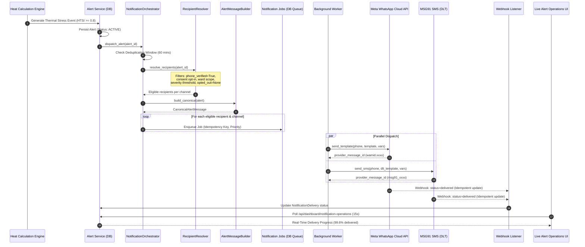
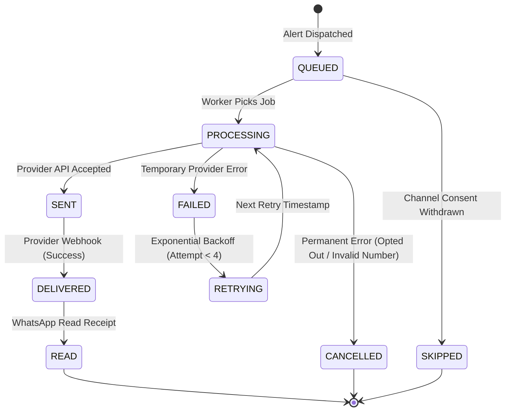

# THERMOSAFE AI — Emergency Notification Flow

```mermaid
sequenceDiagram
    autonumber
    participant Engine as Heat Calculation Engine
    participant AlertSvc as Alert Service (DB)
    participant Orchestrator as NotificationOrchestrator
    participant Resolver as RecipientResolver
    participant Builder as AlertMessageBuilder
    participant Queue as Notification Jobs (DB Queue)
    participant Worker as Background Worker
    participant WA as Meta WhatsApp Cloud API
    participant SMS as MSG91 SMS (DLT)
    participant Webhook as Webhook Listener
    participant UI as Live Alert Operations UI

    Engine->>AlertSvc: Generate Thermal Stress Event (HTSI >= 0.8)
    AlertSvc->>AlertSvc: Persist Alert (Status: ACTIVE)
    AlertSvc->>Orchestrator: dispatch_alert(alert_id)
    
    Orchestrator->>Orchestrator: Check Deduplication Window (60 mins)
    Orchestrator->>Resolver: resolve_recipients(alert_id)
    Note over Resolver: Filters: phone_verified=True,<br/>consent opt-in, ward scope,<br/>severity threshold, opted_out=None
    Resolver-->>Orchestrator: Eligible recipients per channel

    Orchestrator->>Builder: build_canonical(alert)
    Builder-->>Orchestrator: CanonicalAlertMessage

    loop For each eligible recipient & channel
        Orchestrator->>Queue: Enqueue Job (Idempotency Key, Priority)
    end

    par Parallel Dispatch
        Worker->>WA: send_template(phone, template, vars)
        WA-->>Worker: provider_message_id (wamid.xxxx)
    and
        Worker->>SMS: send_sms(phone, dlt_template, vars)
        SMS-->>Worker: provider_message_id (msg91_xxxx)
    end

    WA-->>Webhook: Webhook: status=delivered (Idempotent update)
    SMS-->>Webhook: Webhook: status=delivered (Idempotent update)
    Webhook->>AlertSvc: Update NotificationDelivery status
    UI->>AlertSvc: Poll /api/dashboard/notification-operations (15s)
    AlertSvc-->>UI: Real-Time Delivery Progress (99.6% delivered)
```

---

## State Transition Diagram

```mermaid
stateDiagram-v2
    [*] --> QUEUED: Alert Dispatched
    QUEUED --> PROCESSING: Worker Picks Job
    PROCESSING --> SENT: Provider API Accepted
    SENT --> DELIVERED: Provider Webhook (Success)
    DELIVERED --> READ: WhatsApp Read Receipt
    READ --> [*]

    PROCESSING --> FAILED: Temporary Provider Error
    FAILED --> RETRYING: Exponential Backoff (Attempt < 4)
    RETRYING --> PROCESSING: Next Retry Timestamp

    PROCESSING --> CANCELLED: Permanent Error (Opted Out / Invalid Number)
    CANCELLED --> [*]

    QUEUED --> SKIPPED: Channel Consent Withdrawn
    SKIPPED --> [*]
```
